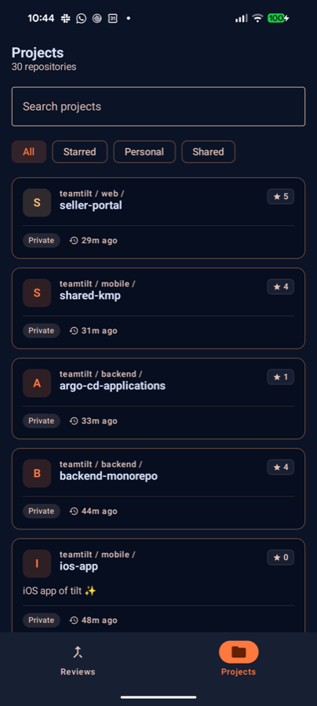
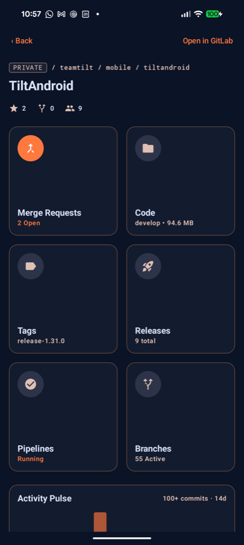
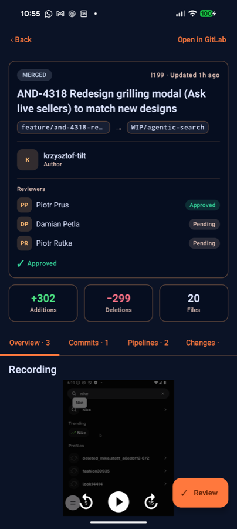
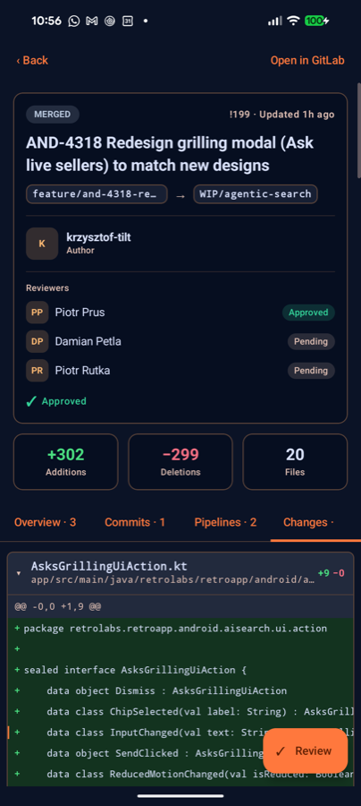

# Tanuki

An open-source, Compose Multiplatform (Android + iOS) client for GitLab — think
"GitHub Mobile, but for GitLab". Browse your projects, review merge requests, and act on
them from your phone.

> Not affiliated with or endorsed by GitLab Inc.

## Screenshots

| Projects | Project dashboard | Merge request | Diff viewer |
|:---:|:---:|:---:|:---:|
|  |  |  |  |

*Dark theme shown; Tanuki follows the system light/dark setting.*

## About

A polished, general-purpose GitLab client that works for **anyone** on gitlab.com — not a
single-company tool. Review your merge requests, keep an eye on your projects and pipelines,
and stay on top of your work without opening a laptop.

## Features

- **Sign in with GitLab** — OAuth through your browser, so 2FA and SSO just work; the app
  never sees your password.
- **Projects** — browse, search, and filter (All / Starred / Personal / Shared) with star counts.
- **Project dashboard** — merge requests, code, tags, releases, pipelines, branches, and an
  activity pulse at a glance.
- **Merge requests** — your review-requested and assigned queues, plus a rich detail view with
  reviewers and approval status, additions/deletions/files, and tabs for Overview, Commits,
  Pipelines, and Changes.
- **Diff viewer** — read changes with horizontally-scrollable code and comment on individual
  lines (view, reply, resolve).
- **Open links in the app** — shared `gitlab.com/…/-/merge_requests/N` links open straight to
  the merge request.
- **Dark & light themes** — follows your system setting.

## Roadmap

- Issues
- Full repository / code browser
- Richer pipelines & CI
- To-dos
- Self-hosted GitLab instances
- Snippets
- iOS release via TestFlight

## Contributing

Contributions are welcome — see [CONTRIBUTING.md](CONTRIBUTING.md).

## License

[MIT](LICENSE) © 2026 Piotr Prus and Tanuki contributors
